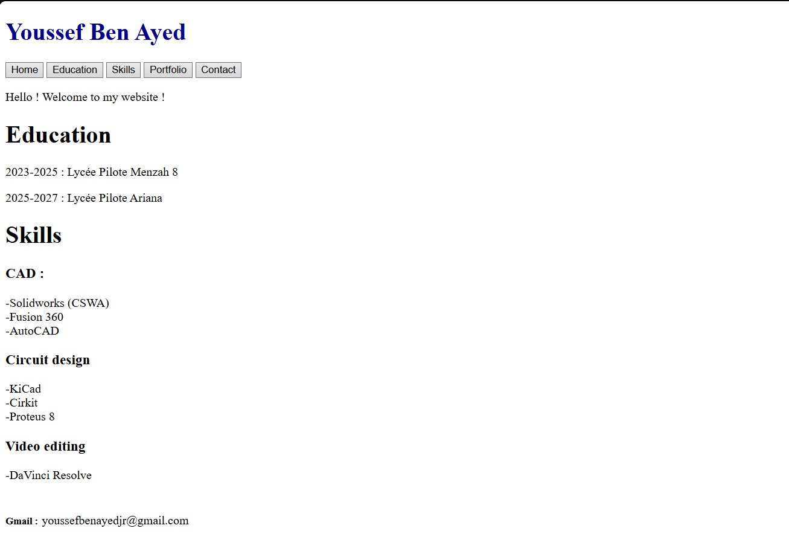
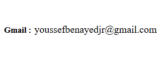
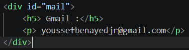

# july 6th : officially started coding !

today is my first day trying html and css. I never used these languages before so i started by searching some tutorials on youtube and see some cool portfolio website and inspect them to see how they were actually built. I also did some research on a website called mozilla then i got started. I mainly focused on the html code as it is not complicated at all and easy to understand. I wrote the main titles and the content I wanted to share on my website.
Progress so far : 
I find some difficulties in aligning the "Gmail :" and the actual adress as they were written with different markups 

but eventually after some research i figured out that the issue is fixed using css.

**Total time spent : 1h 23m**