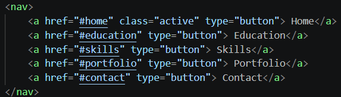
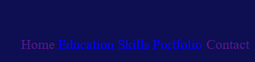
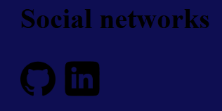
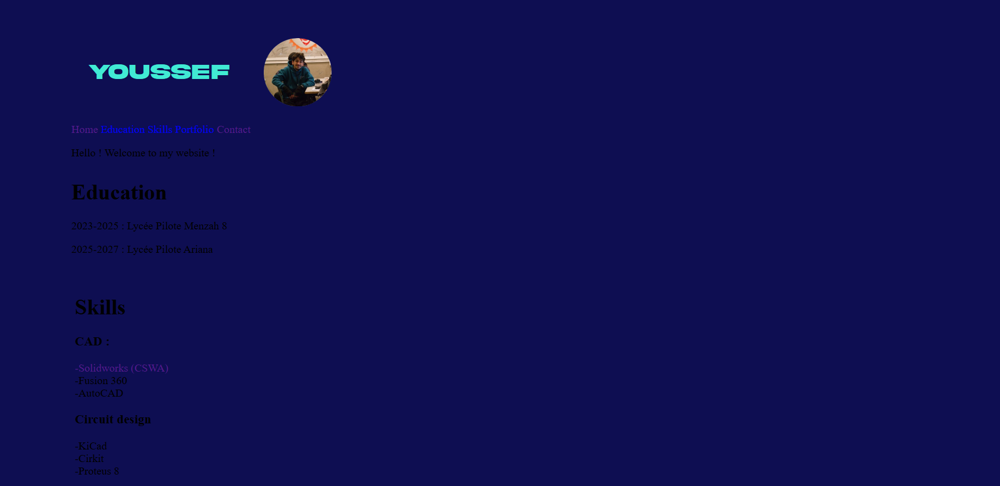
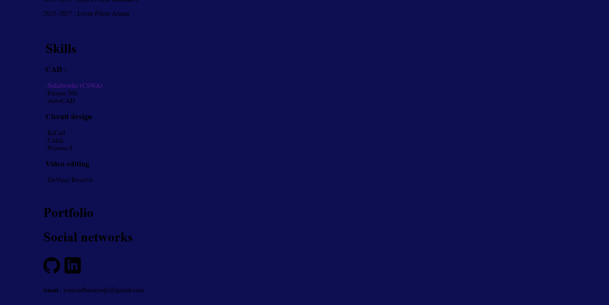
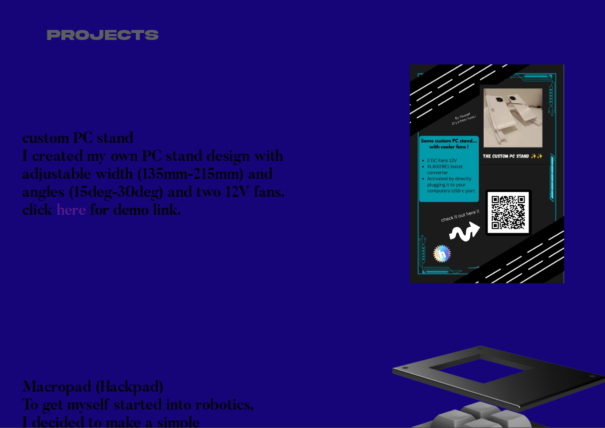
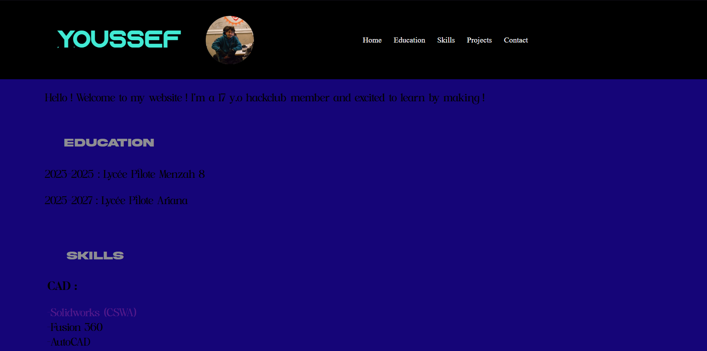
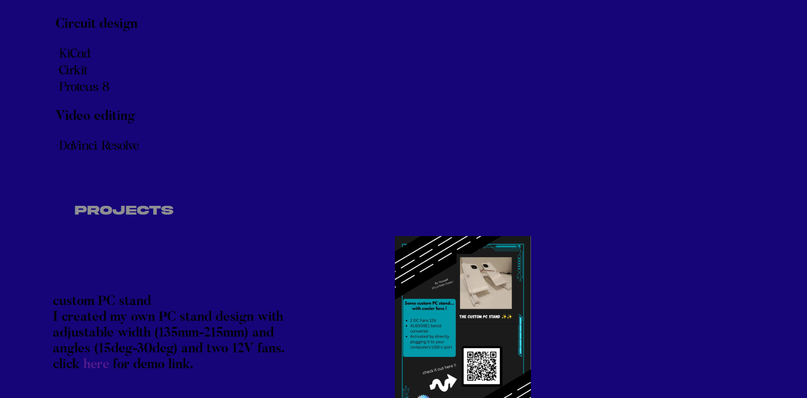
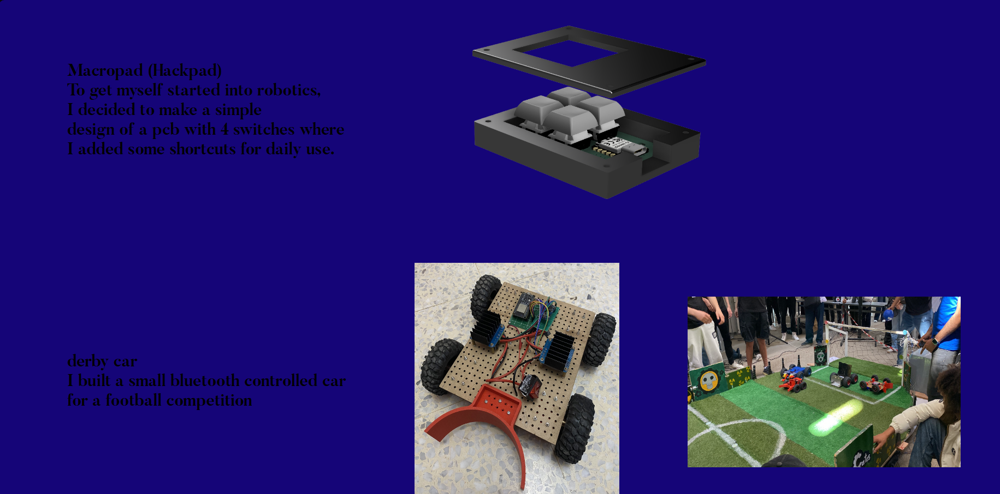
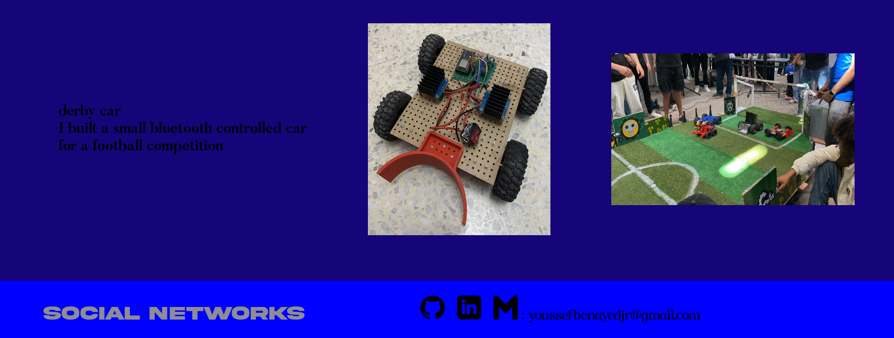

# july 6th : officially started coding !

today is my first day trying html and css. I never used these languages before so i started by searching some tutorials on youtube and see some cool portfolio website and inspect them to see how they were actually built. I also did some research on a website called mozilla then i got started. I mainly focused on the html code as it is not complicated at all and easy to understand. I wrote the main titles and the content I wanted to share on my website.
Progress so far : 

I find some difficulties in aligning the "Gmail :" and the actual adress as they were written with different markups 

but eventually after some research i figured out that the issue is fixed using css.

**Total time spent : 1h 28m**

# july 9th : focusing a bit more on css

After working on most of the html of my website, I started learning more css. I used a website called flexboxfroggy that helped me understand the basics as well as many youtube videos and tutorials. but before that, i tested the header buttons on my website that should transfer me to the headlines and found out that they dont work. after a while (a very long time) i found the issue and corrected it. I used the <button> markup instead of <a> so my buttons couldn't perform any task.

then I added a github and linkedin logo and added the links of my profiles so that when you click on them it takes you to my profile page.

After this, I generated a palette on a website on google and used some of the colors to color my website. I changed the background and the color of my name. I also added a picture of myself next to my name. Finally, I learned how to use the margin, padding and gap functions and used them to adjust the space between the elements of the website. This whole process took me 2 days but the coding time was only 2 hours, as I spent most of the time learning css and html. I am really satisfied by the progress I made so far and I'm excited to learn more each day.
progress so far :

**Total time spent : 2h 8m 23s** 

# july 12th : more html and css

I worked on the fonts, adjusting the sizes, the paddings and the margins. then I set different background colors for the header, body and footer (it's bad i know i will change them later it was just for setting the div size) I also added an effect to the titles when the cursor gets close to them. The color shifts from light grey to a bit darker grey.

 

I also updated the projects section and added some of my projects with the gitub link on the image for some. 

progress so far :

**Total time spent : 2h 52m**